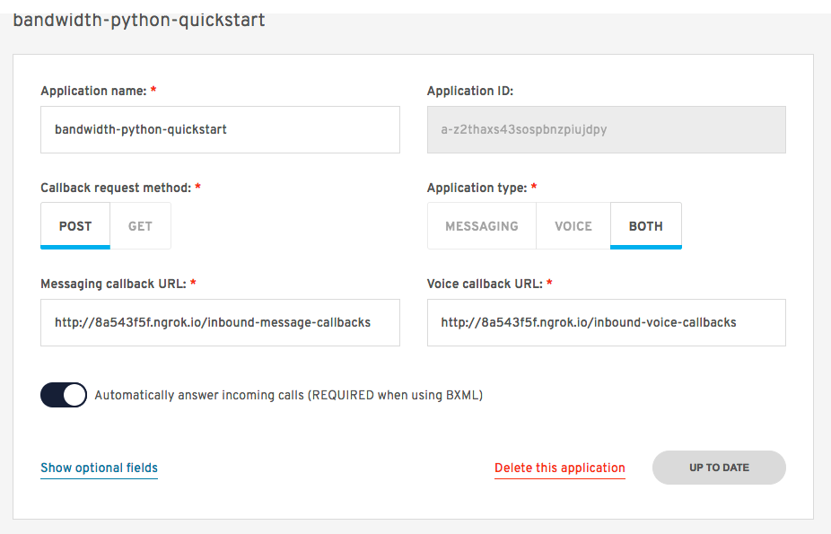

# bandwidth-python-quickstart
Simple Quickstart for Bandwidth and Python 3 using Flask

## Pre-reqs

* [Bandwidth Account](http://dev.bandwidth.com)
* `userId`, `token`, & `secret` set as environment variables
* [ngrok](https://ngrok.com/) Installed with account
* [Python 3](https://www.python.org/downloads/)
* [VirtualEnv](http://docs.python-guide.org/en/latest/dev/virtualenvs/)

## Installation

[Video Walkthrough]()

### Clone this repo

```bash
git clone https://github.com/dtolb/bandwidth-python-quickstart.git

cd bandwidth-python-quickstart
```


### Create [Virtual Environment](http://docs.python-guide.org/en/latest/dev/virtualenvs/)

```bash
virtualenv -p {location_of_python3} bandwidth-python-quickstart
```

### Install requirements

```bash
pip freeze > requirements.txt
```

### Launch the App

```bash
FLASK_APP=app.py flask run
```

### Setup with ngrok

[Ngrok](https://ngrok.com) is an awesome tool that lets you open up local ports to the internet.

Once you have ngrok installed, open a new terminal tab and navigate to it's location on the file system and run:

```bash
./ngrok http 5000
```

You'll see the terminal show you information


### Create a bandwidth application

Head to [http://app.bandwidth.com](http://app.bandwidth.com) to create a new application

Set the application type to:

* Name: `bandwidth-python-quickstart`
* HTTP Method: `POST`
* App Type: `BOTH` : Both voice and messaging
* Voice callback URL: `http://your_ngrok.ngrok.io/inbound-voice-callbacks`
* Messaging callback URL: `http://your_ngrok.ngrok.io/inbound-message-callbacks`



### Assign a phone number to the application

If you don't already have a phone number, order one from the dashboard.


### 👍👍 Then call that or text that number 👍👍